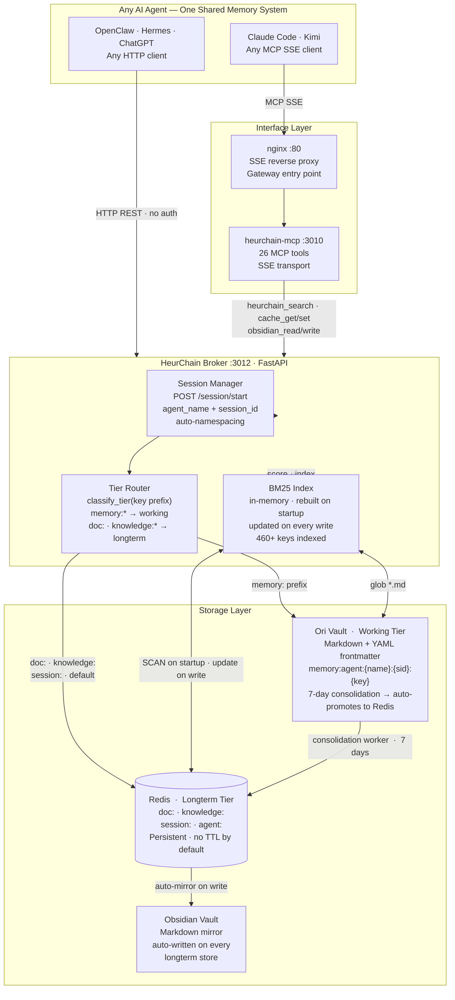
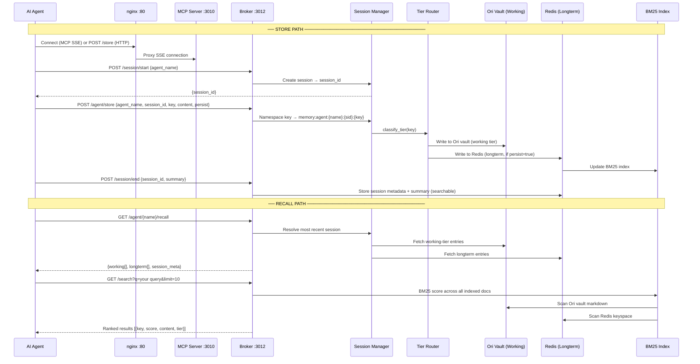

# HeurChain

**One memory system. Every AI agent.**

HeurChain is a universal persistent memory layer for AI agents. Claude Code, Kimi, Hermes, OpenClaw, ChatGPT, and any HTTP or MCP client share the same tiered knowledge store — BM25-ranked search, session continuity, and automatic tier promotion — without any agent-specific configuration beyond a URL and an interface choice.

[](https://www.npmjs.com/package/heurchain-mcp)
[](LICENSE)
[](https://nodejs.org)
[](https://docs.docker.com/compose/)

---

## Tested agents

| Agent | Protocol | Status |
|---|---|---|
| **Claude Code** | MCP SSE via nginx | ✓ Connected |
| **Kimi (Moonshot)** | MCP SSE via nginx | ✓ Connected — full read/write confirmed |
| **Hermes** | HTTP REST direct to broker | ✓ Connected — all 12 endpoints verified |
| **OpenClaw** | HTTP REST direct to broker | ✓ Connected — session lifecycle, BM25, persist flag |
| **ChatGPT / GPT Actions** | HTTP REST via nginx | ✓ Compatible |
| **Any HTTP client** | REST — no auth required | ✓ Compatible |

---

## Architecture



---

## Data flow — Prompt to Memory to Recall



---

## Install — one line

### Docker standalone (full stack — recommended)

```bash
# Clone and start
git clone <repo-url> heurchain && cd heurchain/docker
cp .env.example .env
docker compose -f docker-compose.standalone.yml up -d --build
```

Four containers start in dependency order:

```
heurchain-redis  →  heurchain-broker  →  heurchain-mcp  →  heurchain-nginx
```

Verify:

```bash
curl http://localhost:3012/health   # broker — Redis + vault status
curl http://localhost:3010/health   # MCP server
curl http://localhost/              # nginx gateway (SSE entry point)
```

### npm (MCP server only — requires a running broker)

```bash
npm install heurchain-mcp
```

The npm package ships `server.js` and `AGENT_CONFIG.json`. The broker (FastAPI + Redis) must be running separately — use Docker standalone or the Ansible role for a managed host.

---

## Agent wiring

### Claude Code

Add to your project's `.mcp.json`:

```json
{
  "mcpServers": {
    "heurchain": {
      "type": "sse",
      "url": "http://<your-host>/sse"
    }
  }
}
```

Enable in `.claude/settings.local.json`:

```json
{
  "enabledMcpjsonServers": ["heurchain"]
}
```

Restart Claude Code. Confirm with `claude mcp list` — you should see `heurchain: ✓ Connected`.

All 26 tools are then available in-context. Use `heurchain_search` for knowledge base queries (BM25 ranked). Use `cache_set` / `cache_get` for direct Redis access.

---

### Kimi (Moonshot) and other MCP SSE clients

Same as Claude Code — point at the nginx gateway SSE endpoint:

```
http://<your-host>/sse
```

Kimi confirmed: full read/write, all tools available including `heurchain_search`, `obsidian_write_note`, `user_context_add_entry`, Prometheus, Grafana, Proxmox, and Ceph tools.

---

### OpenClaw

Add to your OpenClaw agent config or environment:

```env
HEURCHAIN_URL=http://<your-host>:3012
```

Use direct REST calls to the broker. No SSE required. OpenClaw agents confirmed: session start/end, `/agent/store` with persist flag, BM25 search, full session recall all working.

```javascript
// Start a session
const { session_id } = await fetch(`${HEURCHAIN_URL}/session/start`, {
  method: 'POST',
  headers: { 'Content-Type': 'application/json' },
  body: JSON.stringify({ agent_name: 'openclaw', metadata: { task: 'current task' } })
}).then(r => r.json());

// Store with persistence
await fetch(`${HEURCHAIN_URL}/agent/store`, {
  method: 'POST',
  headers: { 'Content-Type': 'application/json' },
  body: JSON.stringify({
    agent_name: 'openclaw', session_id,
    key: 'task_result', content: '...', persist: true
  })
});

// BM25 search
const { results } = await fetch(`${HEURCHAIN_URL}/search?q=campaign+status&limit=10`).then(r => r.json());
```

---

### Hermes / Ori-Mnemos

Direct HTTP to the broker. Hermes confirmed all 12 endpoints, Swagger UI at `/docs`, OpenAPI spec at `/openapi.json`.

```python
import httpx

BASE = "http://<your-host>:3012"

# Session lifecycle
session = httpx.post(f"{BASE}/session/start", json={"agent_name": "hermes"}).json()
session_id = session["session_id"]

# Store working memory
httpx.post(f"{BASE}/agent/store", json={
    "agent_name": "hermes", "session_id": session_id,
    "key": "embedding_notes", "content": "...", "persist": False
})

# Recall prior context
context = httpx.get(f"{BASE}/agent/hermes/recall").json()

# End session
httpx.post(f"{BASE}/session/end", json={"session_id": session_id, "summary": "..."})
```

---

### ChatGPT / GPT Actions

Point GPT Actions at the nginx gateway. The broker speaks plain JSON — no special headers required.

```yaml
openapi: 3.1.0
info:
  title: HeurChain Memory API
  version: 2.0.0
servers:
  - url: http://<your-host>
paths:
  /search:
    get:
      operationId: searchMemory
      parameters:
        - name: q
          in: query
          required: true
          schema: { type: string }
        - name: limit
          in: query
          schema: { type: integer, default: 10 }
  /store:
    post:
      operationId: storeMemory
      requestBody:
        content:
          application/json:
            schema:
              type: object
              required: [key, content]
              properties:
                key: { type: string }
                content: { type: string }
                tier: { type: string, enum: [auto, working, longterm] }
```

---

### Generic HTTP (PowerShell, curl, any client)

```powershell
# Store
Invoke-RestMethod -Method POST -Uri "http://<host>:3012/store" `
  -ContentType "application/json" `
  -Body '{"key":"doc:myapp:notes","content":"hello world","tier":"longterm"}'

# Search
Invoke-RestMethod "http://<host>:3012/search?q=hello&limit=5"

# Start session
$s = Invoke-RestMethod -Method POST -Uri "http://<host>:3012/session/start" `
  -ContentType "application/json" -Body '{"agent_name":"ps-agent"}'
```

```bash
# curl
curl -X POST http://<host>:3012/store \
  -H "Content-Type: application/json" \
  -d '{"key":"doc:myapp:notes","content":"hello world"}'

curl "http://<host>:3012/search?q=hello&limit=5"
```

---

## Session protocol

Every agent interaction should follow this lifecycle. Read `AGENT_CONFIG.json` (bundled with the npm package) for the full machine-readable version.

```
Startup
  1. POST /session/start  →  {session_id}
  2. GET  /agent/{name}/recall  →  restore prior context
  3. GET  /health  →  verify backends before starting work

During work
  • POST /agent/store  persist=false  →  scratch notes (working tier)
  • POST /agent/store  persist=true   →  durable findings (both tiers)
  • GET  /search?q=   →  query knowledge base before answering

Shutdown
  1. Persist key findings with persist=true
  2. POST /session/end  {session_id, summary}  →  summary is searchable in future sessions
```

---

## API reference

All endpoints are on the broker at `:3012`. No authentication required.

| Method | Path | Description |
|---|---|---|
| `GET` | `/health` | Redis, Ori vault, Obsidian vault status |
| `GET` | `/docs` | Swagger UI |
| `GET` | `/openapi.json` | OpenAPI 3.1 spec |
| `POST` | `/store` | Store memory with auto tier routing |
| `GET` | `/get?key=&tier=` | Get by exact key (all/longterm/working) |
| `GET` | `/search?q=&limit=&tier=` | BM25 ranked search across all tiers |
| `GET` | `/keys?prefix=` | List Redis keys by prefix |
| `POST` | `/promote?key=&new_key=` | Promote working-tier entry to longterm Redis |
| `POST` | `/session/start` | Start agent session → `{session_id}` |
| `POST` | `/session/end` | End session, attach summary |
| `GET` | `/session/{id}` | Session metadata |
| `GET` | `/session/{id}/context` | All memory stored under a session |
| `GET` | `/agent/{name}/sessions` | All sessions for an agent, newest first |
| `GET` | `/agent/{name}/recall` | Full context of most recent session |
| `POST` | `/agent/store` | Store with automatic `agent_name + session_id` namespacing |

---

## Key schema and tier routing

Keys determine which storage tier receives the write. Tier routing is automatic when `tier=auto` (default).

| Key pattern | Tier | Purpose |
|---|---|---|
| `memory:agent:{name}:{sid}:{key}` | working | Session-scoped scratch space |
| `doc:agent:{name}:{key}` | longterm | Agent persistent documents |
| `doc:{domain}:{topic}` | longterm | Shared reference documents |
| `knowledge:{domain}:{key}` | longterm | Shared knowledge base |
| `session:{id}` | longterm | Session metadata (auto-managed) |
| `agent:{name}:sessions` | Redis SET | Session registry (auto-managed) |

Always namespace your agent's own keys with your `agent_name` to prevent collisions with other agents.

---

## MCP tool reference

Available when connected via SSE (Claude Code, Kimi, any MCP client):

| Category | Tools |
|---|---|
| Cache | `cache_set`, `cache_get`, `cache_delete`, `redis_stats` |
| Search | `heurchain_search` ← **preferred** (BM25 ranked), `obsidian_search_notes` (fallback) |
| Vault | `obsidian_write_note`, `obsidian_read_note`, `obsidian_delete_note`, `obsidian_list_notes` |
| Monitoring | `prometheus_query`, `prometheus_get_targets`, `prometheus_get_alerts` |
| Grafana | `grafana_get_health`, `grafana_list_dashboards` |
| Infrastructure | `proxmox_get_cluster_status`, `proxmox_list_nodes`, `proxmox_find_vm` |
| Ceph | `ceph_get_health_status`, `ceph_list_osd_notes` |
| Network | `network_search_docs`, `network_get_runbook` |
| User context | `user_context_add_entry`, `user_context_get_history`, `user_context_search_history` |
| Health | `health_check` |

Use `heurchain_search` over `obsidian_search_notes` for any knowledge base query — it runs BM25 over the full Redis keyspace (460+ keys), not just filesystem markdown files.

---

## Configuration

Set via `.env` (Docker standalone) or Ansible inventory (managed host).

| Variable | Default | Description |
|---|---|---|
| `REDIS_HOST` | `localhost` | Redis hostname |
| `REDIS_PORT` | `6379` | Redis port |
| `MEMORY_BROKER_PORT` | `3012` | Broker listen port |
| `MCP_PORT` | `3010` | MCP server listen port |
| `NGINX_PORT` | `80` | Host-side nginx port (SSE entry point) |
| `HEURCHAIN_PORT` | `3012` | Host-side broker port |
| `OBSIDIAN_VAULT_PATH` | `./data/obsidian-vault` | Markdown vault root |
| `ORI_VAULT_PATH` | `./data/ori-vault` | Working tier markdown directory |
| `GRAFANA_USER` | `admin` | Grafana auth for MCP monitoring tools |
| `GRAFANA_PASSWORD` | `admin` | Grafana auth for MCP monitoring tools |
| `OLLAMA_URL` | `http://host.docker.internal:11434` | Ollama for consolidation worker |
| `CONSOLIDATE_AGE_DAYS` | `7` | Age threshold before working-tier auto-promotes to longterm |

---

## Deployment

### Ansible (production — managed Linux host)

Provisions the full stack: system Redis, HeurChain broker (systemd service), Docker MCP stack, Prometheus + Grafana monitoring.

```bash
# 1. Fill in inventory
cp inventory.yml.example inventory.yml
vim inventory.yml

# 2. Deploy everything
ansible-playbook playbook.yml

# 3. Selective re-deploys
ansible-playbook playbook.yml --tags heurchain     # broker only
ansible-playbook playbook.yml --tags docker        # MCP + nginx stack only
ansible-playbook playbook.yml --tags system-redis  # Redis config only
ansible-playbook playbook.yml --tags monitoring    # Prometheus + Grafana only
```

Role order: `system-prereqs` → `obsidian-vault` → `system-redis` → `heurchain` → `docker-stack` → `monitoring`

### Docker standalone (development / unmanaged hosts)

```bash
cd docker/
cp .env.example .env
docker compose -f docker-compose.standalone.yml up -d --build
```

Requires Docker Compose v2 (`docker compose` plugin or `docker-compose >= 2.x`).

---

## License

MIT
