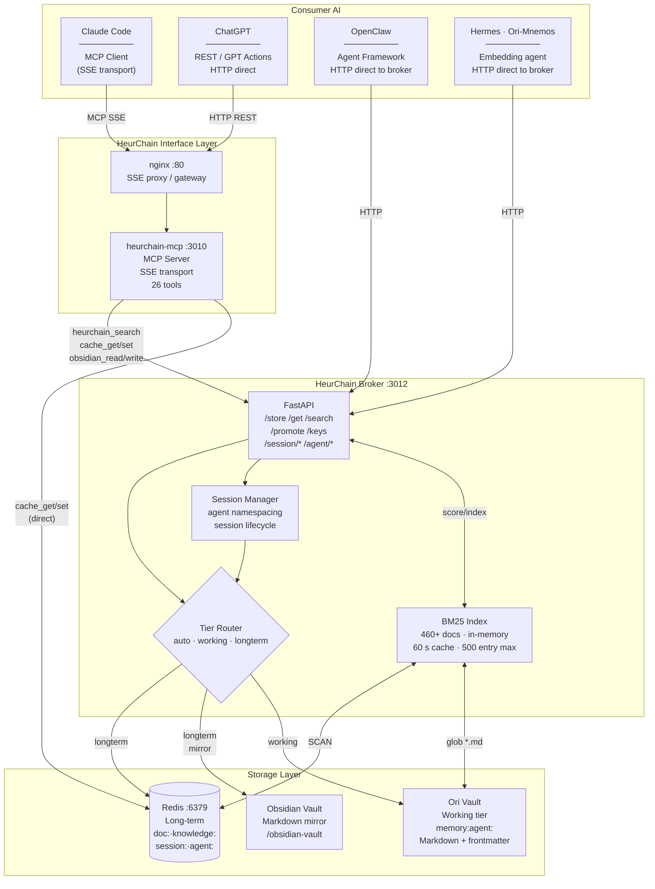
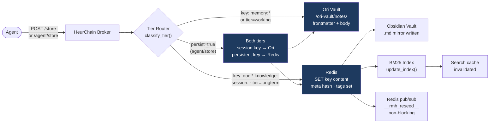
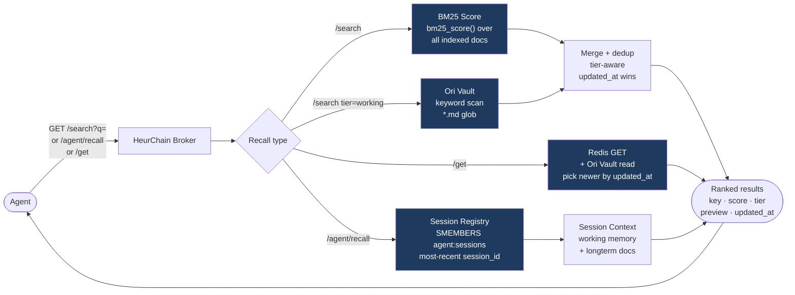

# HeurChain

Unified agent memory stack — tiered knowledge storage, BM25 search, and per-agent session tracking for AI systems. Provides both an HTTP broker API and an MCP (Model Context Protocol) interface so any consumer AI can read and write persistent memory.

---

## Architecture



---

## Memory Storage Flow



---

## Memory Recall Flow



---

## Consumer AI Integration

| Client | Protocol | Entry point | Notes |
|---|---|---|---|
| **Claude Code** | MCP SSE | `http://host:80/sse` | Full 26-tool MCP interface via nginx gateway |
| **ChatGPT** | HTTP REST | `http://host:80/api/` | Use as a GPT Action with the `/api/tools` manifest |
| **OpenClaw** | HTTP | `http://host:3012/` | Direct broker API — all session/agent endpoints |
| **Hermes / Ori-Mnemos** | HTTP | `http://host:3012/` | Direct broker API — uses `/promote` for consolidation |

### MCP tools (Claude Code / MCP clients)

| Category | Tools |
|---|---|
| Cache | `cache_set`, `cache_get`, `cache_delete`, `redis_stats` |
| Vault | `obsidian_write_note`, `obsidian_read_note`, `obsidian_delete_note`, `obsidian_list_notes` |
| **Search** | **`heurchain_search`** (BM25 ranked, preferred), `obsidian_search_notes` (filesystem fallback) |
| Monitoring | `prometheus_query`, `prometheus_get_targets`, `prometheus_get_alerts` |
| Grafana | `grafana_get_health`, `grafana_list_dashboards` |
| Infrastructure | `proxmox_get_cluster_status`, `proxmox_list_nodes`, `proxmox_find_vm` |
| Ceph | `ceph_get_health_status`, `ceph_list_osd_notes` |
| Network | `network_search_docs`, `network_get_runbook` |
| User context | `user_context_add_entry`, `user_context_get_history`, `user_context_search_history` |
| Health | `health_check` |

---

## Key Schema

| Pattern | Tier | Written by | Purpose |
|---|---|---|---|
| `doc:{topic}:{subtopic}` | longterm | Any agent | Reference documents |
| `knowledge:{domain}:{key}` | longterm | Any agent | Domain knowledge base |
| `session:{id}` | longterm | Broker | Session metadata JSON |
| `agent:{name}:sessions` | Redis SET | Broker | Registry of agent session IDs |
| `memory:agent:{name}:{sid}:{key}` | working | Broker | Session-scoped working memory |
| `doc:agent:{name}:{key}` | longterm | Broker | Agent persistent documents |
| `self:{filename}` | longterm | Startup seed | Ori vault self/ identity files |

---

## Deployment

### Ansible (managed host — recommended for production)

Provisions the full stack on a Linux host: system Redis, HeurChain broker (systemd), MCP Docker stack, monitoring.

```bash
# 1. Copy and fill in inventory
cp inventory.yml.example inventory.yml
vim inventory.yml

# 2. One-shot deploy
ansible-playbook playbook.yml

# 3. Selective re-deploys
ansible-playbook playbook.yml --tags heurchain     # broker only
ansible-playbook playbook.yml --tags docker        # MCP stack only
ansible-playbook playbook.yml --tags system-redis  # Redis config only
ansible-playbook playbook.yml --tags monitoring    # Prometheus + Grafana only
```

**Role order:** `system-prereqs` → `obsidian-vault` → `system-redis` → `heurchain` → `docker-stack` → `monitoring`

### Docker standalone (zero host dependencies)

Runs everything in containers. No Ansible required. Good for development or non-managed hosts.

```bash
cd docker/

# 1. Configure
cp .env.example .env
vim .env

# 2. Build and start
docker compose -f docker-compose.standalone.yml up -d --build

# 3. Check health
curl http://localhost:3012/health   # broker
curl http://localhost:3010/health   # MCP
curl http://localhost/              # nginx gateway
```

**Services:** `heurchain-redis` → `heurchain-broker` → `heurchain-mcp` → `heurchain-nginx`

> **Ori vault:** In the Docker standalone, `ORI_VAULT_PATH` (default `./data/ori-vault`) is a local directory bind-mounted into the broker container. This replaces the CIFS/NFS mount used in the Ansible production setup. The working tier functions identically — it's still a directory of markdown files.

---

## Broker API Reference

| Method | Path | Description |
|---|---|---|
| `GET` | `/health` | Service health — Redis, Ori vault, Obsidian vault status |
| `POST` | `/store` | Store memory with auto tier routing |
| `GET` | `/get?key=&tier=` | Get memory by key (all/longterm/working) |
| `GET` | `/search?q=&limit=&tier=` | BM25 ranked search across all tiers |
| `GET` | `/keys?prefix=` | List Redis keys by prefix |
| `POST` | `/promote?key=` | Promote Ori vault entry to longterm Redis |
| `POST` | `/session/start` | Start agent session → returns `session_id` |
| `POST` | `/session/end` | End session, attach optional summary |
| `GET` | `/session/{id}` | Session metadata |
| `GET` | `/session/{id}/context` | All memory for a session (working + longterm) |
| `GET` | `/agent/{name}/sessions` | All sessions for an agent, newest first |
| `GET` | `/agent/{name}/recall` | Full context of most recent session |
| `POST` | `/agent/store` | Store with automatic agent+session namespacing |

---

## Configuration

All services are configured via environment variables. The Ansible inventory sets them for the managed deployment; `.env` sets them for Docker standalone.

| Variable | Default | Description |
|---|---|---|
| `REDIS_HOST` | `localhost` | Redis hostname |
| `REDIS_PORT` | `6379` | Redis port |
| `MEMORY_BROKER_PORT` | `3012` | HeurChain broker listen port |
| `OBSIDIAN_VAULT_PATH` | `/opt/obsidian-vault` | Markdown vault root |
| `ORI_VAULT_PATH` | `/opt/ori-vault` | Working tier markdown directory |
| `MCP_PORT` | `3010` | MCP server listen port |
| `HEURCHAIN_URL` | `http://host.docker.internal:3012` | Broker URL seen from MCP container |
| `GRAFANA_USER` | `admin` | Grafana auth for MCP tools |
| `GRAFANA_PASSWORD` | `admin` | Grafana auth for MCP tools |
| `OLLAMA_URL` | `http://host.docker.internal:11434` | Ollama for consolidation worker |
| `CONSOLIDATE_AGE_DAYS` | `7` | Age threshold for working-tier consolidation |
