# HeurChain: Two-Tier Consolidating Memory for AI Agents

> *Agents shouldn't wake up with amnesia.*

HeurChain is a memory architecture for AI agents inspired by hippocampal memory consolidation in biological brains. It gives agents bounded working memory that self-organizes through decay and consolidation — not a static retrieval corpus, but a living memory system where recent experiences are immediately available, aging memories compress into retrieval cues, and everything persists permanently in long-term storage.

This is not RAG. RAG ingests documents once and retrieves them forever at uniform cost. HeurChain models how memory actually works: recent things are vivid and free, old things require effort to recall, and the system manages its own capacity without human intervention.

---

## Table of Contents

- [Why](#why)
- [Architecture](#architecture)
- [How It Works](#how-it-works)
- [The Four Design Properties](#the-four-design-properties)
- [Retrieval: Three Speeds](#retrieval-three-speeds)
- [Working Memory Note Types](#working-memory-note-types)
- [The Compressor LLM](#the-compressor-llm)
- [Cue Design](#cue-design)
- [The Memory Broker](#the-memory-broker)
- [Comparison](#comparison)
- [Implementation Stack](#implementation-stack)
- [Status](#status)
- [Open Problems](#open-problems)

---

## Why

AI agents have a memory problem with three faces:

**1. Statelessness.** Every session starts from zero. The agent has no recollection of yesterday's decisions, last week's debugging session, or the user's preferences learned over months of interaction. Context windows are queues, not graphs — old information doesn't get organized, it falls off the end.

**2. Unbounded accumulation.** Naive solutions (append everything to a file, stuff it all into the prompt) hit token limits and degrade quality. An agent that remembers everything equally remembers nothing well.

**3. Static retrieval.** Standard RAG treats memory as a warehouse: ingest once, retrieve forever, never reorganize. Documents don't age, don't compress, don't self-organize based on access patterns. There's no difference between something encountered five minutes ago and something ingested two years ago.

Biological memory solves all three. The hippocampus holds recent experiences in rich detail, consolidates them into compressed long-term representations during sleep, and retrieves them through associative cues rather than sequential search. HeurChain applies the same principles to agent memory.

---

## Architecture

```mermaid
flowchart TB
    subgraph RUNTIME["⚙️ AGENT RUNTIME"]
        direction TB

        subgraph T1["📋 TIER 1 — Working Memory (HeurChain Vault)"]
            direction TB
            ops["**ops/**\nHot full context\n200–800 tokens\ndecay: 3×"]
            notes["**notes/**\nActive cues + wiki-links\n5–15 tokens\ndecay: 1×"]
            self["**self/**\nIdentity & methodology\ndecay: 0.1×"]

            ops -->|"vitality < threshold"| CW
            CW["**Consolidation Worker**\nCompressor LLM"]
            CW -->|"generates cue"| cue
            cue["📎 Cue note\n*'TD600 NPT stainless 600 PSIG'*\n&#91;&#91;tier2:chunk_a83f&#93;&#93;"]
        end

        subgraph T2["🗄️ TIER 2 — Long-Term Memory"]
            direction LR
            pg["**PostgreSQL 16**\nchunks + BM25 FTS\nexact keyword search"]
            qd["**Qdrant**\nvector embeddings\nsemantic similarity"]
            pg <-->|"RRF hybrid fusion"| qd
            pg --> lf["**Langfuse**\ntraces every retrieval"]
            qd --> lf
        end

        MB["**Memory Broker** *(FastAPI :3012)*\nPOST /store · tier routing · consolidation timers\nSingle write interface — agents never write tiers directly"]

        ADB["**Phase 3 — ArcadeDB Graph Overlay**\nCross-tier traversal · native vector index · Apache 2.0\nCypher + Gremlin + SQL"]
    end

    CW -->|"full content"| T2
    cue -->|"follow link"| T2
    RUNTIME --> MB
    MB --> ADB
```



---

## How It Works

### The Consolidation Lifecycle

```
Day 0    Agent experiences something
         └─► stored as full-context note in ops/ (200-800 tokens)

Day 1-6  Note accessed occasionally
         └─► vitality refreshed on each access → stays as full context

Day 7    Note untouched → vitality decays below threshold
         └─► consolidation worker fires

Day 7+   Compressor LLM generates 5-15 token retrieval cue
         └─► full content pushed to Tier 2 (PostgreSQL + Qdrant)
         └─► cue written to notes/ with wiki-link: [[tier2:chunk_id]]
         └─► original ops/ note removed

Day 14+  Agent encounters related query
         └─► cue found in working memory → link followed → full context fetched
```

### ACT-R Cognitive Decay

Working memory uses the ACT-R activation model from cognitive science. Each note has a **vitality** score that decays over time and refreshes on access. Different directories decay at different rates:

- **`ops/`** — operational context, 3× base decay rate. Today's debugging session is vivid now, fading by next week.
- **`notes/`** — general knowledge and cues, 1× base decay rate. Standard retention.
- **`self/`** — identity, methodology, preferences, 0.1× base decay rate. Near-permanent. The agent's sense of self doesn't evaporate.

When vitality drops below threshold, the note is a consolidation candidate. The system never deletes — it compresses and migrates.

### What Happens at Session Start

The agent's context window is populated with the full contents of Tier 1. No retrieval step, no embedding lookup, no latency. Recent experiences, active cues, and identity files are just *there* — the same way you wake up knowing who you are and what you were working on yesterday.

This is the key architectural insight: **the most valuable memories are the ones you don't have to search for.**

---

## The Four Design Properties

Most memory systems are defined by what they store and how they retrieve. HeurChain is defined by four properties that constrain how memory *behaves*. These aren't implementation details — they're design commitments.

### 1. Zero-Hop Working Memory

The entirety of Tier 1 loads into the agent's context window at session start. No query. No lookup. No latency. The agent wakes up knowing what it was working on, who it is, and what it has recently learned — the same way you don't have to look up your own name.

This isn't an optimization. It's a constraint. Working memory is sized and pruned to *always* fit in a context window. The decay system is the enforcement mechanism for this constraint. Notes that exceed their welcome are compressed and promoted — they don't stay at the cost of crowding out everything else.

**The corollary:** anything the agent needs to search for is, by definition, not in working memory. The three-speed retrieval system exists precisely because some things should be instant and some things should require effort. That asymmetry is intentional.

### 2. Agent-Transparent Memory Management

The agent never calls a memory management function. It doesn't say "remember this," "forget that," or "consolidate now." Memory management is infrastructure, not cognition. The consolidation worker runs in the background, watches vitality scores, and makes migration decisions without agent involvement.

This matters because agents that manage their own memory have a reliability problem: they forget to remember. Every system that requires explicit `store_memory()` calls has failure modes where the agent doesn't call it — because it was rate-limited, because the context was full, because the prompt didn't emphasize it. HeurChain removes the failure mode by removing the requirement.

The agent writes to the broker. The broker decides where things go. The agent reads what's in its context. Everything else happens underneath.

### 3. Directory-Typed Decay as Semantic Categorization

The three decay directories (`ops/`, `notes/`, `self/`) aren't just rate parameters — they're a claim about the structure of knowledge an agent holds.

**Operational knowledge** (`ops/` — 3× decay) is intrinsically transient. What you debugged yesterday is less relevant next week. Aggressive decay is correct here, not a loss.

**Reference knowledge** (`notes/` — 1× decay) is the background layer: established facts, domain knowledge, resolved questions. It should persist longer but eventually yield to Tier 2.

**Identity** (`self/` — 0.1× decay) is near-permanent because it has to be. An agent that forgets its methodology, its owner's preferences, or its operating constraints is a different agent. The 0.1× rate means identity files effectively never consolidate under normal use.

A new note type needs a rate decision before it needs a content decision. Where does it belong in the semantic taxonomy? The rate follows from that answer.

### 4. Cue as Pre-Retrieval Decision Gate

The cue enables something no query-based retrieval system provides: the agent can see that a memory *exists* before deciding whether to pay the retrieval cost.

In standard retrieval systems, the agent fires a query into a black box and gets back results. It doesn't know what it doesn't know — there's no signal that something relevant exists before it asks. The cue inverts this. The agent sees `"TD600 NPT stainless 600 PSIG" [[tier2:chunk_a83f]]` in its working memory and makes a decision: is this relevant to what I'm doing right now? If yes, follow the link. If no, ignore it. The cue costs 5–15 tokens. The decision is free. The retrieval hop only happens if it's warranted.

The cue is not a summary. Summaries communicate meaning. Cues discriminate. A good cue is one that, given the cue alone, points to exactly one memory in Tier 2. The compression task is to find the minimum discriminative representation — the shortest string of tokens that uniquely identifies this memory in the space of all stored memories.

This is closer to an index key than a description.

---

## Retrieval: Three Speeds

| Speed | Mechanism | Hops | Latency | When |
|-------|-----------|------|---------|------|
| **Instant** | Full content already in working memory | 0 | 0ms | Recent experiences, active tasks |
| **Fast** | Cue in working memory → follow `[[tier2:id]]` link | 1 | ~5-20ms | Consolidated memories with cue still in Tier 1 |
| **Deep** | BM25 + semantic search across all of Tier 2 | full scan | ~50-200ms | Old memories, no cue present, exploratory recall |

**Instant** is free — it's already in the prompt. This is where today's work lives.

**Fast** costs one hop. The agent sees the cue (`"TD600 NPT stainless 600 PSIG" [[tier2:chunk_a83f]]`), recognizes it's relevant, and follows the link. The cue acts as a discriminative index — the agent can decide *whether* to retrieve before paying any retrieval cost.

**Deep** is a full hybrid search. PostgreSQL BM25 handles exact keyword matches (product codes, IDs, specific terms). Qdrant handles semantic similarity (conceptual relatedness, paraphrase matching). Results are fused using Reciprocal Rank Fusion (RRF). Every deep retrieval is traced in Langfuse for observability.

The three speeds mirror how human memory works: you know your name instantly, you can recall yesterday's meeting with a moment's thought, and you can dredge up a college lecture if you think hard enough.

---

## Working Memory Note Types

| Type | Content | Tokens | Decay Rate | Fate |
|------|---------|--------|------------|------|
| **Hot context** | Full experience, verbatim | 200–800 | `ops/` 3× fast | Consolidates around day 7 |
| **Active cue** | LLM-compressed retrieval key + wiki-link | 5–15 | `notes/` 1× | Lives until pruned or accessed |
| **Identity** | Agent state, methodology, preferences | Varies | `self/` 0.1× | Near-permanent |

The vault is Obsidian-compatible markdown on disk. No proprietary format, no database lock-in for Tier 1. An agent's working memory is a folder you can open in any text editor.

---

## The Compressor LLM

Consolidation requires compressing a 200-800 token note into a 5-15 token retrieval cue. This is done by an LLM with specific constraints:

**Same model, already loaded.** The compressor uses whatever model the agent is already running. No cold start, no additional VRAM, no second model to maintain. If the agent runs Llama 3 8B, consolidation runs Llama 3 8B.

**Deterministic generation.** Temperature 0.1. The cue for a given note should be stable across runs. This isn't creative writing — it's index construction.

**Standardized prompt.** The compression prompt is fixed and version-controlled:

```
Compress this note into 5-15 tokens that would uniquely retrieve it.
Prioritize: product codes, proper nouns, specific numbers, technical terms.
Avoid: generic descriptions, function words, obvious categories.

Note:
{content}

Cue:
```

**The output is a retrieval key, not a summary.** The cue doesn't need to be human-readable or convey meaning on its own. It needs to contain enough discriminative information that, given the cue, exactly one note in Tier 2 is the obvious match.

---

## Cue Design

This is the most counterintuitive part of the system. The cue is **not a summary**. It's a mnemonic — a pattern of specific terms that triggers precise recall.

```
Bad:  "information about steam traps and their specifications"
Good: "TD600 NPT stainless 600 PSIG drip trap condensate"
```

The bad cue matches hundreds of notes. The good cue matches one.

Design principles:

- **Proper nouns over common nouns.** "Acme Corp Q3 deployment" not "a company's quarterly release."
- **Numbers over ranges.** "600 PSIG" not "high pressure."
- **Product codes over descriptions.** "TD600" not "steam trap model."
- **Technical terms over plain language.** "NPT stainless" not "threaded metal fitting."
- **Specific over general.** Always. The cue's job is discrimination, not comprehension.

The cue lives in working memory at 5-15 tokens — trivial context cost. When the agent encounters a situation where the cue is relevant, it follows the wiki-link and gets the full content from Tier 2 in one hop.

---

## The Memory Broker

All agent writes route through a single FastAPI service. Agents never write directly to the Ori vault or to PostgreSQL/Qdrant.

```
POST /store
{
  "key": "td600-steam-trap-specs",
  "content": "The TD600 is a thermodynamic drip trap rated for 600 PSIG...",
  "tier": "hot|working|longterm|auto",
  "metadata": {
    "source": "agent:main",
    "tags": ["equipment", "steam"]
  }
}
```

**`tier: auto`** (default) lets the broker decide placement based on content characteristics and agent context. Hot operational data goes to `ops/`, reference material may go directly to Tier 2, and the broker manages consolidation timers for everything in between.

The broker is the single source of truth for write operations. It:

- Routes content to the appropriate tier
- Sets consolidation timers for Tier 1 notes
- Pushes content + embeddings to Tier 2 on consolidation
- Notifies the graph watcher (Phase 3) for relationship indexing
- Logs every operation for debugging and replay

One door in. This prevents split-brain states where Tier 1 and Tier 2 disagree about what exists.

---

## Comparison

| | **HeurChain** | **Standard RAG** | **Chat History** | **Vector DB** |
|---|---|---|---|---|
| **Self-organizing** | ✅ Decay + consolidation | ❌ Static after ingest | ❌ Append-only | ❌ Static after ingest |
| **Bounded context cost** | ✅ Working memory self-prunes | ❌ Retrieval count is manual | ❌ Grows without limit | ❌ Top-K is manual |
| **Cross-session** | ✅ Persists across sessions, machines, models | ⚠️ Corpus persists, context doesn't | ❌ Per-session or per-thread | ⚠️ Corpus persists, context doesn't |
| **Zero-cost recent recall** | ✅ Full context in prompt | ❌ Always requires retrieval | ⚠️ If within window | ❌ Always requires retrieval |
| **Aging / decay** | ✅ ACT-R cognitive model | ❌ No concept of age | ❌ No concept of age | ❌ No concept of age |
| **Compression** | ✅ LLM-generated cues | ❌ N/A | ❌ N/A | ❌ N/A |
| **Hybrid retrieval** | ✅ BM25 + vector + RRF | ⚠️ Usually vector-only | ❌ Sequential scan | ✅ Vector (no keyword) |
| **Observability** | ✅ Langfuse on every retrieval | ⚠️ Varies | ❌ Rarely | ⚠️ Varies |
| **Agent identity** | ✅ `self/` persists personality, methodology | ❌ No concept | ❌ No concept | ❌ No concept |
| **Format** | Markdown (Obsidian-compatible) | Chunks in DB | JSON/text logs | Embeddings in DB |

---

## Implementation Stack

This is a reference implementation, not an abstraction layer. The components are:

| Component | Technology | Role |
|-----------|-----------|------|
| **Tier 1: Working Memory** | [Ori-HeurChain](https://github.com/openclaw/ori-mnemos) v0.5.0 | Node.js, markdown vault, ACT-R decay engine, wiki-link resolution, MCP server interface |
| **Tier 2: Long-Term Store** | PostgreSQL 16 + Qdrant | Chunks with BM25 full-text search (pg) + dense vector embeddings (Qdrant) |
| **Consolidation** | Python worker + Ollama | Watches vitality thresholds, runs compressor LLM, migrates content |
| **Memory Broker** | FastAPI | Single write interface, tier routing, consolidation scheduling |
| **Observability** | Langfuse | Traces every retrieval with latency, tier, fusion scores |
| **Graph Overlay** *(Phase 3)* | ArcadeDB | Cross-tier graph traversal, native vector index, relationship discovery |

### Why These Choices

- **Markdown vault for Tier 1** because working memory should be inspectable. Open a folder, read the files, understand the agent's current state. No database required for hot data.
- **PostgreSQL for BM25** because full-text search on exact terms (product codes, IDs) is where vector search fails. BM25 finds "TD600" when the embedding for "steam trap" drifts.
- **Qdrant for vectors** because semantic similarity catches what keywords miss. "How do I handle condensate in high-pressure lines?" should find the TD600 note even without exact term overlap.
- **RRF fusion** because combining ranked lists from heterogeneous retrieval systems is a solved problem, and RRF is simple, parameter-free, and effective.
- **Langfuse** because memory systems that can't be debugged can't be trusted. Every retrieval should be traceable: what was queried, what was returned, which tier, which fusion weights, what latency.

---

## Status

HeurChain is a **working reference implementation**, not a packaged library.

- ✅ Tier 1 (Ori-HeurChain) is in production use with OpenClaw agents
- ✅ ACT-R decay and vitality tracking operational
- ✅ Tier 2 PostgreSQL + Qdrant store with hybrid retrieval
- ✅ Memory Broker routing writes across tiers
- ✅ Langfuse observability integrated
- 🔧 Consolidation worker in active development
- 🔧 Compressor LLM prompt undergoing evaluation (cue quality metrics)
- 📋 Phase 3 graph overlay (ArcadeDB) designed, not yet implemented

The architecture is stable. The interfaces are stable. Individual components can be swapped — use Milvus instead of Qdrant, use a different LLM for compression, use a different decay model. The value is in the pattern, not the specific stack.

### What We're Learning

- Cue quality is the bottleneck. A bad cue is worse than no cue — it wastes context tokens on a dead-end retrieval path. We're building evaluation harnesses for cue discriminativeness.
- Decay rates need per-domain tuning. An agent working on a week-long project needs different `ops/` decay than one handling one-off questions. We're exploring adaptive decay based on task structure.
- The 5-15 token cue range was chosen empirically. Shorter cues lose discriminative power. Longer cues start duplicating what Tier 2 search already provides. The sweet spot may shift with model capability.

---

## Open Problems

These are the known hard problems in the current implementation. They're open because the right answer isn't obvious, not because they've been neglected.

### Cue Quality is the Bottleneck

The system's retrieval quality is bounded by the quality of its cues. A bad cue is worse than no cue: it occupies context tokens in working memory pointing at something that won't match at retrieval time. The compression prompt produces cues of variable quality across note types — technical content (product codes, IDs, specific terms) cues well; conceptual content (decisions, reasoning, preferences) cues poorly.

Current approach: evaluation harnesses measuring cue discriminativeness against the Tier 2 corpus.

Unknown: whether a larger compressor model produces substantially better cues for conceptual content, or whether the problem is inherent to the compression format.

### Decay Rates Need Domain Calibration

The baseline rates (3×, 1×, 0.1×) were chosen empirically for a specific deployment context — long-running, multi-day projects with a single primary agent. Different contexts need different rates.

An agent handling one-off questions should have much faster `ops/` decay. An agent deep in a month-long project should have slower decay so context from last week stays hot. The current system has static rates; the right system adapts them to task structure.

One direction: the Memory Broker tracks access patterns across sessions and adjusts decay rates per directory based on observed dwell time vs. access frequency.

### Consolidation Doesn't Merge

When five notes about the same subject consolidate over five days, they produce five separate Tier 2 chunks. Deep retrieval finds all five and returns them, but they're not organized as a unified record. Over time, Tier 2 accumulates fragmented coverage of the same topics from different temporal perspectives.

The consolidation worker should detect when a note being consolidated is semantically close to existing Tier 2 content and merge rather than insert — updating an existing record rather than creating a new one. This requires a pre-consolidation similarity check: query Tier 2 for neighbors above a cosine threshold and let the compressor LLM decide whether to merge or create.

### No Cross-Note Synthesis

The current consolidation model is one-to-one: one hot note becomes one Tier 2 chunk plus one cue. There's no mechanism for the system to notice patterns *across* notes and synthesize higher-order knowledge.

Example: after three weeks of interaction, there may be 40 `ops/` notes revealing that the agent's owner works on infrastructure late on weeknights, prefers terse responses after 10pm, and escalates urgency when mentioning "prod." None of these individual notes is worth preserving past consolidation. But the *pattern* across them — a behavioral model of the user — is extremely valuable and should live in `self/` permanently.

A synthesis pass — running periodically across a batch of candidates before they consolidate — could extract these higher-order patterns. The compressor LLM prompt would shift: instead of "compress this note into a cue," it becomes "what do these N notes reveal about the user's preferences or patterns?"

### Relevance-Weighted Decay

Current decay is purely temporal and access-based. A note decays at its directory rate unless it's read. But an `ops/` note about database configuration is more relevant when the agent is currently working on a database problem than when it's doing creative writing. Relevance to current context should slow decay.

One approach: the broker tracks the agent's recent query embeddings via the Langfuse retrieval trace. When computing vitality, the decay rate is multiplied by `(1 - relevance_to_current_context)`. Notes relevant to current work decay slower. Notes from a completed task decay at full speed.

This requires the broker to have a model of "what the agent is currently doing" — derivable from the last N queries or from an explicit current-task marker in `self/`.

---

## Contributing

This is an independent research project developed on top of the [OpenClaw](https://github.com/openclaw) agent infrastructure. It is not an official OpenClaw project. If you're building agent memory systems and this resonates, open an issue. Particularly interested in:

- Alternative decay models (beyond ACT-R)
- Cue quality evaluation methods
- Graph-based memory traversal patterns
- Cross-agent memory sharing architectures

---

## License

MIT


---

## Citations & Theoretical Foundations

The HeurChain architecture draws on research in cognitive developmental psychology, neuroscience, and information retrieval. The following works directly inform its design:

### Memory Strategies & Deliberate Recall

**Kail, R. (1990).** *The Development of Memory in Children* (3rd ed.). W.H. Freeman.
> Foundation for the concept of deliberate memory strategies — the idea that memory improvement comes from intentional, goal-directed encoding actions. Directly informs the cue generation step: the compressor LLM performs a deliberate encoding act, not passive storage.

**Paris, S. G., Newman, R. S., & Jacobs, J. E. (1985).** "The social context of strategy learning." In S. F. Chipman, J. W. Segal, & R. Glaser (Eds.), *Thinking and Learning Skills, Vol. 2*. Erlbaum.
> Defines a *strategy* as "a deliberately selected action performed for the purpose of attaining a particular goal." The HeurChain consolidation worker applies this — cue generation is a deliberate, goal-directed compression act.

**DeLoache, J. S., Cassidy, D. J., & Brown, A. L. (1985).** "Precursors of mnemonic strategies in very young children's memory." *Child Development, 56*(1), 125–137.
> Demonstrated that memory strategies emerge very early when the right scaffolding is present. In HeurChain: the wiki-link structure is the scaffold — agents don't need to "know" where memories are, the graph structure guides retrieval.

**Hasher, L., & Clifton, D. (1974).** "A developmental study of attribute encoding in free recall." *Journal of Experimental Child Psychology, 17*(3), 332–346.
> Showed that older children organize memory by semantic categories (clustering) rather than surface/situational associations. HeurChain replicates this: Tier 2 is organized by semantic embeddings (meaning-based clustering), not by time of ingestion or source.

### Hippocampal Memory Consolidation

**McClelland, J. L., McNaughton, B. L., & O'Reilly, R. C. (1995).** "Why there are complementary learning systems in the hippocampus and neocortex: Insights from the successes and failures of connectionist models of learning and memory." *Psychological Review, 102*(3), 419–457.
> The foundational Complementary Learning Systems (CLS) theory. Hippocampus = fast, specific, episodic (Tier 1). Neocortex = slow, generalized, semantic (Tier 2). HeurChain implements CLS in software.

**Anderson, J. R., & Lebiere, C. (1998).** *The Atomic Components of Thought*. Lawrence Erlbaum Associates.
> Source of ACT-R (Adaptive Control of Thought–Rational) — the cognitive architecture whose base-level learning equations govern Tier 1 decay in Ori-HeurChain. ACT-R predicts activation strength as a function of recency and frequency of use.

### Information Retrieval

**Robertson, S., & Zaragoza, H. (2009).** "The probabilistic relevance framework: BM25 and beyond." *Foundations and Trends in Information Retrieval, 3*(4), 333–389.
> BM25 theoretical foundation. Directly used in Tier 2 PostgreSQL full-text search. Critical for exact-term retrieval (product codes, proper nouns) that semantic search misses.

**Cormack, G. V., Clarke, C. L. A., & Buettcher, S. (2009).** "Reciprocal rank fusion outperforms Condorcet and individual rank learning methods." *SIGIR 2009*.
> The RRF algorithm used to fuse BM25 and semantic search results. Score: `1 / (k + rank)` where k=60 is the standard constant.

---

*This README is a living document. Researchers whose work directly influences ongoing development will be added as the architecture evolves.*

### Primary Source Textbook

**Cole, M., & Cole, S. R. (1993).** *The Development of Children* (2nd ed.). Scientific American Books / W.H. Freeman.
> The primary source text from which the memory strategy research was drawn for this architecture. Chapter 12 ("Cognitive and Biological Development") covers clustering strategies, deliberate memory encoding, and the knowledge base effects on recall — all foundational concepts in HeurChain's Tier 1 design.

### Neurophysiology of Memory — Primary Source

**Carlson, N. R. (1994).** *Physiology of Behavior* (5th ed.). Allyn and Bacon.
> The neurophysiological foundation for HeurChain's two-tier architecture. Chapter 15 provides the biological basis for working memory / reference memory distinction and hippocampal consolidation.

Key passages directly informing the design:

**On working vs. reference memory (Olton, 1983, as cited in Carlson):**
> "Working memory consists of information about things that have just happened, information that is useful in the immediate future but may change from day to day. Thus, it is 'erasable' memory that is replaced on a regular basis. **Reference memory** is permanent, long-term memory, produced by consistent conditions."

This is the exact distinction HeurChain encodes as Tier 1 (ops/ space, fast decay) vs Tier 2 (PostgreSQL, permanent). The terminology — working memory and reference memory — comes directly from this research.

**On hippocampal context encoding (Penick and Solomon, 1991, as cited in Carlson):**
> "Several experiments indicate that hippocampal damage does, indeed, disrupt an animal's ability to distinguish particular contexts."

HeurChain's Tier 1 cues serve as **context anchors** — they preserve the episodic context of when and why information was acquired, not just the information itself.

**On spatial/episodic working memory (Olton and Samuelson, 1976, as cited in Carlson):**
> Hippocampal lesions severely impaired rats' ability to remember where they had just been, while reference memory (long-term learned locations) remained intact.

This dissociation — episodic recency impaired, semantic long-term intact — is precisely why HeurChain maintains two separate stores rather than one unified vector database.

**On consolidation (Figure 15.2 model):**
> Sensory information → Short-term memory → [Consolidation] → Long-term memory, with a Rehearsal loop back to short-term memory.

The consolidation arrow in Carlson's Figure 15.2 is structurally identical to HeurChain's consolidation worker: the process that moves full-context hot notes from Tier 1 (short-term/working) to Tier 2 (long-term) after the rehearsal period expires.

#### Secondary citations from Carlson (Chapter 15):

**Olton, D. S., & Samuelson, R. J. (1976).** "Remembrance of places passed: Spatial memory in rats." *Journal of Experimental Psychology: Animal Behavior Processes, 2*(2), 97–116.

**Olton, D. S., Collison, C., & Werz, M. A. (1977).** "Spatial memory and radial arm maze performance of rats." *Learning and Motivation, 8*(3), 289–314.

**Olton, D. S. (1983).** "Memory functions and the hippocampus." In W. Seifert (Ed.), *Neurobiology of the Hippocampus*. Academic Press.

**Penick, S., & Solomon, P. R. (1991).** "Hippocampus, context, and conditioning." *Behavioral Neuroscience, 105*(5), 611–617.
